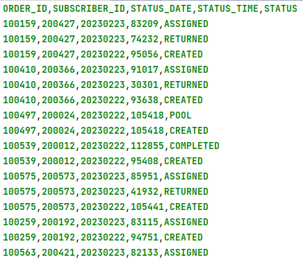
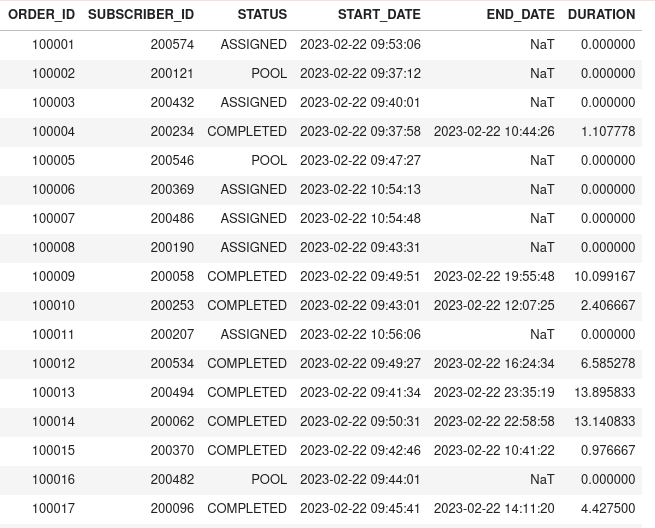

Problem definition:
- Source dataset view:



---

There are different STATUSES in the sales orders of an e-commerce company.

For each status, there is time information.

Business users need the current status of each order. This order should have current STATUS, START_DATE, END_DATE and DURATION if it is completed.

CREATED and POOL status will be considered as START_DATE. COMPLETED and CANCELLED status will be considered END_DATE.

If the order has not been in COMPLETED and CANCELLED, the END_DATE will not be calculated and the DURATION will be 0.

- The schema of the result dataframe:
```commandline
root
 |-- ORDER_ID: string (nullable = true)
 |-- SUBSCRIBER_ID: string (nullable = true)
 |-- STATUS: string (nullable = true)
 |-- START_DATE: timestamp (nullable = true)
 |-- END_DATE: timestamp (nullable = true)
 |-- DURATION: double (nullable = true)
```

- Result dataframe example view:



---